# AZCOT Metrics: exploratory data analysis (wind chill and snow load)

This EDA looks at the pre-computed statistics in `disk1/Metrics`, the most directly usable part of the AZCOT dataset. It covers what the files contain, how each metric is actually computed (checked against the raw hourly data), which operational questions the metrics can and can't answer, and the data quirks to know before using them. The examples use **wind chill temperature (WCT)** and **snow load (SL)**. Everything here comes from the 30-year (1991–2020) climatological metrics. There are no per-year values in `Metrics`.

Background is drawn from the two reports in `docs/`: ERDC/CRREL TR-26-5 (*AZCOT*, the main technical report) and SR-25-2 (*Development and Management of Arctic Zonal Characterization Products*). Their text is extracted to `eda/reference/` for searching.

## Key takeaways

- **The metrics are trustworthy and reproduce the published report.** Recomputing from these files gives an average land WCT of −24.0 °F (TR-26-5: −23.9), 7.68% of hours at or below −65 °F (7.66%), an average snow load of 13.8 lb/ft² (13.8), and an average highest load of 42.95 lb/ft² (42.9). The report used unweighted grid-cell means, which over-count high latitudes. Area-weighted, the −65 °F share is 5.9%.
- **`min_WCT` is not the record low.** It is the 30-year *average of each year's lowest hour*, which is 44 °F warmer than the true record at Fairbanks on Jan 15. The published Atlas maps are *not* affected: their "Lowest Recorded" WCT rasters hold the true record (checked grid-wide), so only this `Metrics` field is off. For true record lows over land, read the Atlas Extreme GeoTIFFs. Within `Metrics`, `percentile_1` is the closest stand-in.
- **Feb 29 is built from 8 leap years, and its `min_WCT` is wrong.** It divides the sum of 8 yearly minima by 30, which makes it roughly 3.75× too warm. Exclude Feb 29 from extremes.
- **Snow load over glaciers is a placeholder.** ERA5 caps snow on permanent ice at about 10 m water equivalent (2047 lb/ft²). About 8% of grid cells (Greenland, the ice caps, and the St. Elias range) must be masked out.
- **Wind chill at or below −65 °F (the Army materiel requirement) is rare outside a few places:** the Greenland ice sheet, the Canadian Arctic Archipelago, and northeastern Siberia. About 10% of land never reached it once in 30 winters.
- **For snow load, the planning answer depends on whether you design for a typical year or the worst one.** The typical seasonal peak stays below the 25 lb/ft² life-support structure spec on 57% of non-glacier land, but the 30-year record stays below it on only 14%.

---

## 1. What is in `disk1/Metrics`

| Directory pattern | Files per variable | One file = |
|---|---|---|
| `daily_{VAR}_stats/{mon}_{DD}_{VAR}_stats.nc` | 183 (Oct 1 – Mar 31, including Feb 29) | one calendar day, pooled over 30 winters (30 yr × 24 h = **720 hourly values**) |
| `6h_{VAR}_stats/{mon}_{DD}_6h_{H1}through{H2}_{VAR}_stats.nc` | 732 | one 6-hour UTC block of one calendar day (30 × 6 = **180 values**) |

Daily variables: `2T, SKT, STL1, WCT, WSPD, SD, SL`. Six-hour variables: `2T, SKT, STL1, WCT, WSPD`. Each file is a single 2-D field with no time dimension. Weekly, monthly, and seasonal values in the Atlas were built by averaging (or taking the min/max of) these daily files, and this EDA does the same.

**Grid:** regular lat/lon, 0.25°, 1440 × 121 cells, 60–90 °N (`g0_lat_0` ascending 60 → 90, `g0_lon_1` −180 → 179.75). The exception is `SD`, which is on the ERA5-Land 0.1° grid (3600 × 301) and is NaN over water. No file has a `units` attribute. The units below were confirmed against the raw data and the reports.

**Variables in the two files used here:**

| File | Variables |
|---|---|
| `daily_WCT_stats` | `averageTemp`, `min_WCT`, `percentile_{1,5,10,15,20,25,50}`, `frequency_{0,−5,…,−100}`, `consecutive_{0,…,−75}`, `consecutive_{…}_no_ones` |
| `daily_SL_stats` | `averageSL`, `max_SL`, `percentile_{50,75,80,85,90,95,99}`, `frequency_{0,5,…,50}` |

Wind chill uses the NWS 2001 formula (Nelson et al. 2002) with 10 m wind speed. The reports say it uses 2 m air temperature, but the hourly `WCT.nc` files were actually computed from **skin temperature** (SKT; found 9 Oct 2026, see quirk 7 and [AZCOT_DATA_ISSUES.md](../AZCOT_DATA_ISSUES.md), issue 10). Snow load is SWE × 5.2 lb/ft² per inch of water, which assumes a flat surface.

## 2. What each metric actually means (verified)

Each definition below was checked by recomputing it from the 720 raw hourly files at specific grid cells (Fairbanks, Utqiagvik; Jan 15, Mar 1, Feb 29).

| Metric | Meaning | Units | Check |
|---|---|---|---|
| `averageTemp` / `averageSL` | mean of the 720 hours | °F / lb/ft² | exact |
| `percentile_N` | Nth percentile of the 720 hours (pandas linear interpolation) | °F / lb/ft² | exact |
| `frequency_T` (WCT) | % of the 720 hours with **WCT ≤ T** | % | exact |
| `frequency_T` (SL) | % of the 720 hours with **SL ≥ T** | % | exact |
| `max_SL` | **true maximum** of the 720 hours | lb/ft² | matches (46.72 vs 46.74, a small regridding difference) |
| `min_WCT` | **mean of the 30 annual minima** (sum of yearly lowest hour ÷ 30), *not* the record minimum | °F | exact at 3 cells, 2 days |
| `consecutive_T` | for each year, the mean length of runs with WCT ≤ T within that day's 24 h (0 if none), averaged over 30 years | hours (0–24) | exact |
| `consecutive_T_no_ones` | same, but ignoring 1-hour runs | hours | exact |

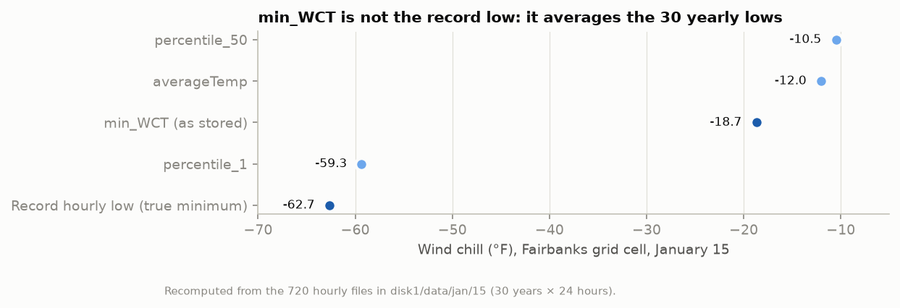

### Data quirks to know before using the files

1. **`min_WCT` ≠ record low.** Both reports describe the "Minimum" metric as the lowest value in 30 years, and the published `zScripts/metricCalculation_frequency.py` does compute a true minimum. The WCT files were evidently built by different code. At Fairbanks on Jan 15 the stored `min_WCT` is −18.7 °F, but the actual coldest hour was −62.7 °F. Note that `max_SL` *is* the true maximum, so the two variables' "extreme" fields use different conventions and can't be compared.

   **The Atlas maps use the true minimum.** Every Atlas folder keeps the GeoTIFF its PDF was rendered from (`disk2/Atlas/{mon}/Daily/{DD}/WCT/Extreme/{mon}_{DD}_WCT_min.tif`). At Fairbanks and Utqiagvik on Jan 15, the raster equals the true hourly minimum exactly (−62.66 and −75.52 °F), not `min_WCT` (−18.70 and −41.17). Across all 61,532 land cells on Oct 15, Jan 15, Feb 29, and Mar 1, the raster never equals `min_WCT`, is always at or below `percentile_1`, and is 26–30 °F colder than `min_WCT` on average (50 °F on Feb 29). The monthly raster is exactly the minimum of the daily rasters, and the whole-season raster reproduces the report's −86.7 °F land average (§3). So the maps and reports are correct, and `disk1/Metrics` `min_WCT` is the only product with the mean-of-annual-lows values. `scripts/check_atlas_min.py` reproduces this check.

2. **Feb 29.** It has only 192 hours (8 leap years), so all of its statistics are noisier. Its `min_WCT` is also computed as sum ÷ 30 instead of ÷ 8: Utqiagvik is stored as −11.1 °F against a true mean of yearly lows of −41.8 °F. This shows up as spikes at Mar 1 in the point charts below. This EDA drops Feb 29 from seasonal aggregates.
3. **Glacier sentinel in SL.** ERA5 holds snow on permanent ice at about 10 m water equivalent, which is 2047.25 lb/ft². Such cells are not real snow loads. This EDA masks a cell as glacier/perennial snow if its Oct 1 average load is already above 50 lb/ft² (seasonal snow starts near zero) or if any hour comes within 5% of the cap. That covers 7.6% of all grid cells.
4. **`consecutive_T` mixes how often and how long.** Because years without a qualifying run count as 0, the metric falls when spells are rare, not just when they are short. Its map therefore looks much like the frequency map. It can't tell you how long a spell lasts *given that one occurs*. Spells are also cut off at midnight UTC, so multi-day cold snaps aren't captured.
5. **Naming and orientation traps.** `daily_SD_stats` stores snow depth in a variable misnamed `averageSL`. The raw hourly files in `disk1/data` store latitude *descending* (90 → 60), the reverse of the Metrics files. Always select by coordinate, never by array index.
6. **Hourly climatology files** (`*.91-20clim.nc` in `disk1/data`) exist only for 2T, SKT, STL1, SD, 10U, 10V, and var29. There are none for WCT, SWE, or SL, so for wind chill and snow load the Metrics *are* the climatology.
7. **Wind chill is from skin temperature** (added 9 Oct 2026). The NWS formula applied to hourly SKT and wind in mph reproduces `WCT.nc` exactly at every cell (40 of 40 random hours tested). With 2 m air temperature it does not. Over land on Jan 15, the skin-temperature wind chill is 3.5 °F colder on average, and it puts 10.1% of hours at or below −65 °F against 5.3% from air temperature. Every wind chill number in this EDA inherits that.

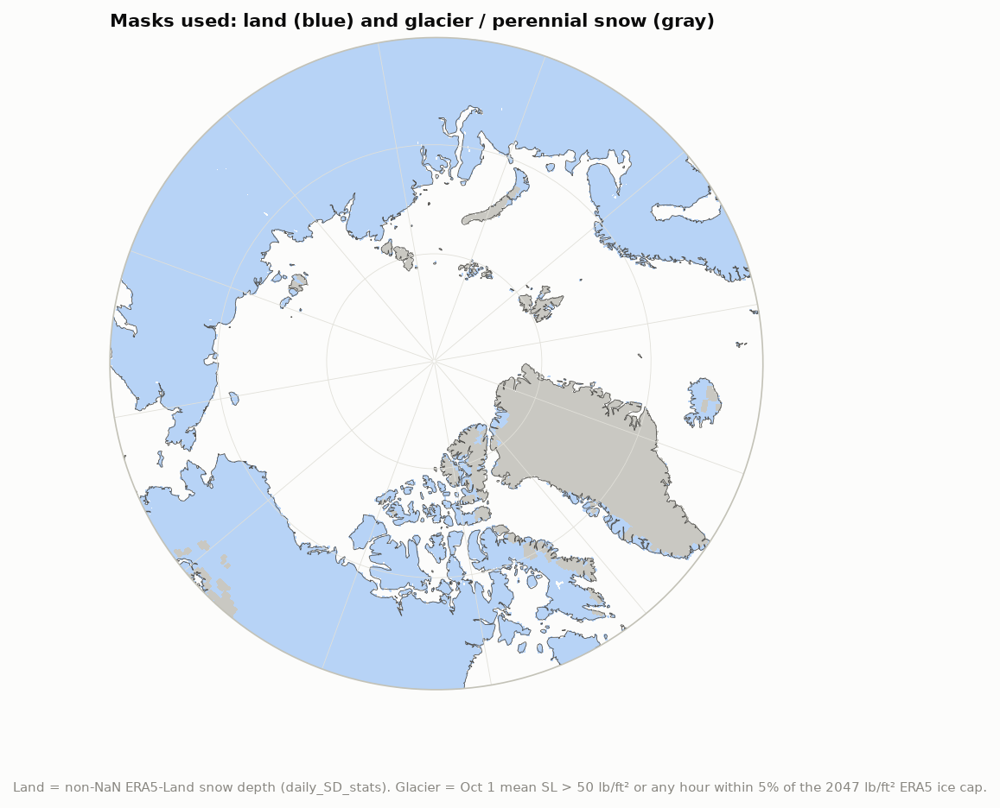

## 3. Sanity check against TR-26-5

`scripts/stats.py` recomputes the report's land-wide numbers from the daily files (Feb 29 excluded). The full table is in `tables/report_comparison.csv`.

| Quantity | This EDA (pixel mean) | Area-weighted | TR-26-5 |
|---|---:|---:|---:|
| Average Oct–Mar wind chill over land (°F) | −24.01 | −20.46 | −23.9 |
| Share of hours with WCT ≤ −65 °F, land (%) | 7.68 | 5.87 | 7.66 |
| Average Oct–Mar snow load, non-glacier land (lb/ft²) | 13.80 | 13.94 | 13.8 |
| Highest recorded snow load, non-glacier land average (lb/ft²) | 42.95 | 43.73 | 42.9 |
| Coldest daily 1st-percentile WCT, land average (°F) | −84.07 | −82.12 | −86.7 (true record) |
| Season record low WCT from the Atlas `year_WCT_min.tif`, land average (°F) | −86.67 | −84.77 | −86.7 |

The first four agree to within rounding. That confirms the interpretation in §2, and shows the report averaged grid cells without area weighting. On a lat/lon grid that gives extra weight to the far north, so area-weighted values are the better choice for "share of the Arctic" statements. The report's "average lowest WCT" (−86.7 °F) can't be reproduced from `Metrics`, because no true WCT minimum is stored there. It *is* reproduced (−86.67) by the whole-season Atlas raster, which holds the true record (§2, item 1).

## 4. Questions the metrics can answer

Thresholds come from the reports. For wind chill, the ATP 3-90.96 cold zones (TR-26-5 Table 2) apply: at −40 °F exposed skin freezes in under 10 minutes, and **−65 °F is the Army materiel requirement** that motivates the project. For snow load, the design loads (TR-26-5 §1) are: tentage 10 lb/ft², rigid shelters 20, **life-sustaining structures 25**, and semipermanent structures 48.

### Q1. How cold does it typically feel, where, and in which month?

Average WCT (`averageTemp`) by month. The Greenland ice sheet is the coldest place in every month. By December–February, the Canadian Arctic Archipelago and interior northeastern Siberia approach it, while the North Atlantic side (Iceland, coastal Norway) stays mild. January and February are the coldest months.

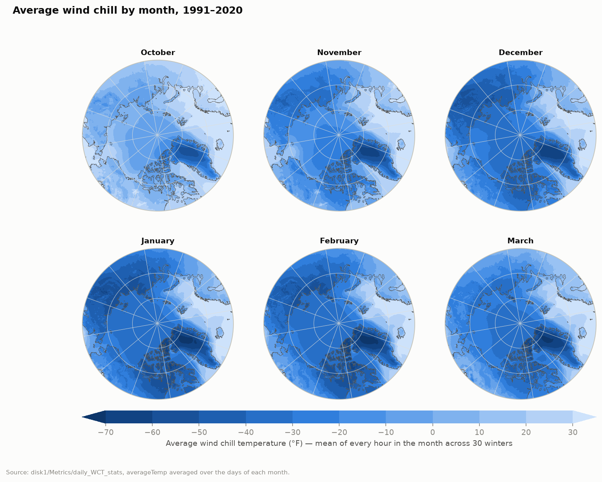

### Q2. How often is wind chill dangerous?

`frequency_-40` is the share of hours when frostbite can occur in under 10 minutes. Even in October, the core of the Greenland ice sheet spends up to 80% of hours below −40 °F (median about 40% across the ice sheet). By midwinter, more than half of all hours in large parts of Siberia and the Canadian Archipelago fall below it, while Scandinavia, Iceland, and southern Alaska stay near 0%. Any threshold from 0 to −100 °F in 5 °F steps can be mapped the same way.

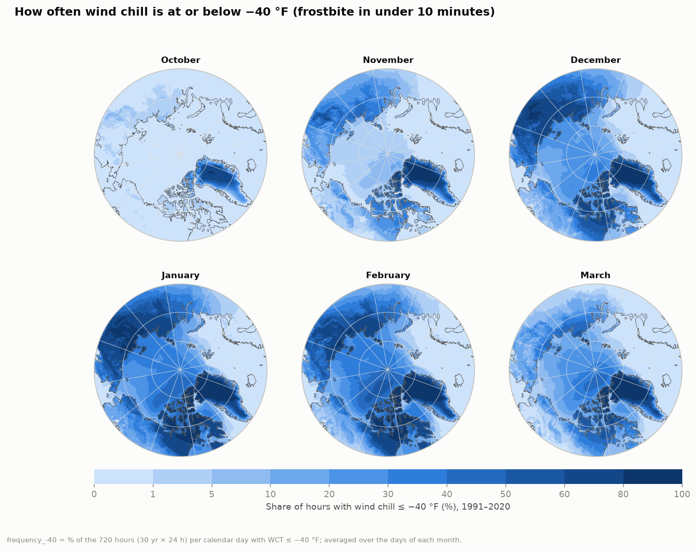

### Q3. Where does the −65 °F requirement actually matter?

Averaged over the season, wind chill at or below −65 °F is concentrated on the Greenland ice sheet (above 50% of hours in the worst month), the Canadian Archipelago, and northeastern Siberia. Across land it accounts for 7.7% of hours by pixel mean, or 5.9% area-weighted. **About 10% of land never reached −65 °F in 30 winters** (`frequency_-65` = 0 on every day), and only 1.5% never reached −40 °F. The answer to TR-26-5's question "are all Arctic material solutions required to operate at −65 °F?" is no. This map shows where lighter-rated materiel would still fit.

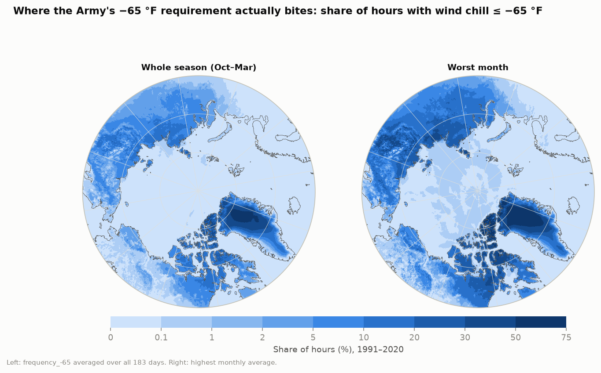

### Q4. Which cold zone should a unit equip for?

Applying the ATP 3-90.96 zones to wind chill gives a direct equipment-planning map. In a *typical* January hour, most of Scandinavia and Iceland falls in zones 2–3, mainland Alaska and Canada in zones 4–5A, and the Archipelago, Siberia, and Greenland in zones 5A–5C. For the *1-in-100-hour* cold (`percentile_1`), almost all land outside the North Atlantic coasts reaches zone 5B or 5C.

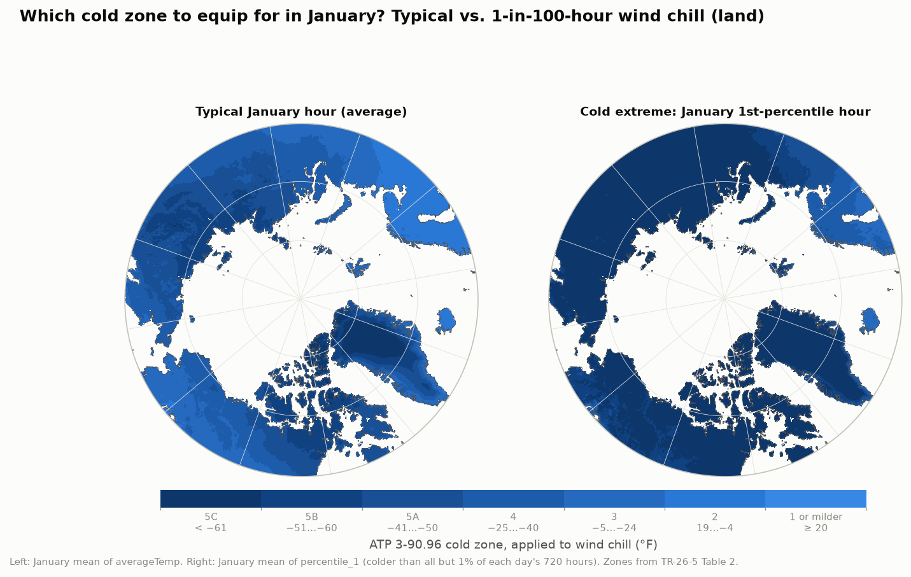

### Q5. How does a specific site behave through the season?

Pulling any grid cell gives a full daily climatology. The shaded band runs from the 1st to the 50th percentile hour. Note how far `min_WCT` (dotted) sits from the bottom of the band, which is the §2 caveat at work, and the Feb 29 spike at Mar 1.

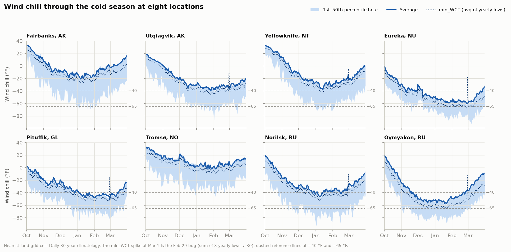

| Location | Jan avg WCT (°F) | Jan 1st-pct WCT (°F) | Season % hrs ≤ −40 | Season % hrs ≤ −65 |
|---|---:|---:|---:|---:|
| Fairbanks, AK | −15.8 | −60.0 | 4.6 | 0.09 |
| Utqiagvik, AK | −33.9 | −65.8 | 19.8 | 0.82 |
| Yellowknife, NT | −30.3 | −66.2 | 12.7 | 0.39 |
| Eureka, NU | −55.0 | −78.0 | 60.2 | 10.59 |
| Pituffik, GL | −43.2 | −71.7 | 36.4 | 3.24 |
| Tromsø, NO | 2.5 | −30.7 | 0.1 | 0.00 |
| Norilsk, RU | −39.5 | −78.0 | 27.9 | 3.89 |
| Oymyakon, RU | −52.9 | −80.3 | 46.9 | 8.25 |

Each location uses its nearest land grid cell (`tables/locations.csv`).

### Q6. How long do dangerous spells last?

This is only partly answerable. `consecutive_-40` closely tracks `frequency_-40` because years with no spell count as zero (§2, item 4). It is useful as an "expected hours per day spent in a spell" index, but not as a measure of how long spells last once they start.

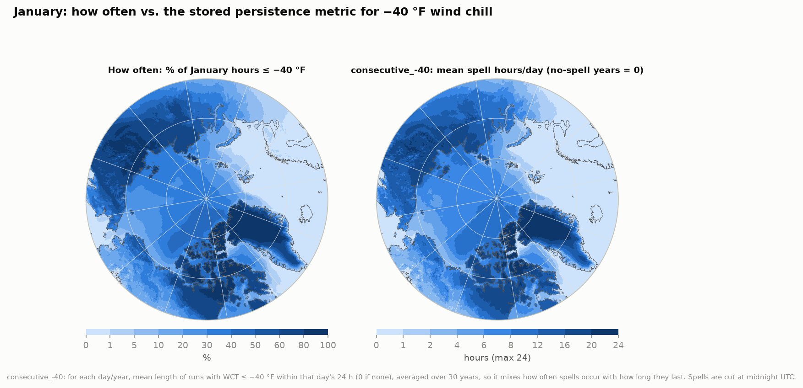

### Q7. How heavy is the snow load, and how does it build?

Average snow load grows steadily from October to March and peaks at the end of the season. The heaviest loads are in western Siberia and the Yenisei basin, the Scandinavian mountains, and parts of northern Russia and Alaska. Interior northeastern Siberia and the high Arctic stay light because they get little snow.

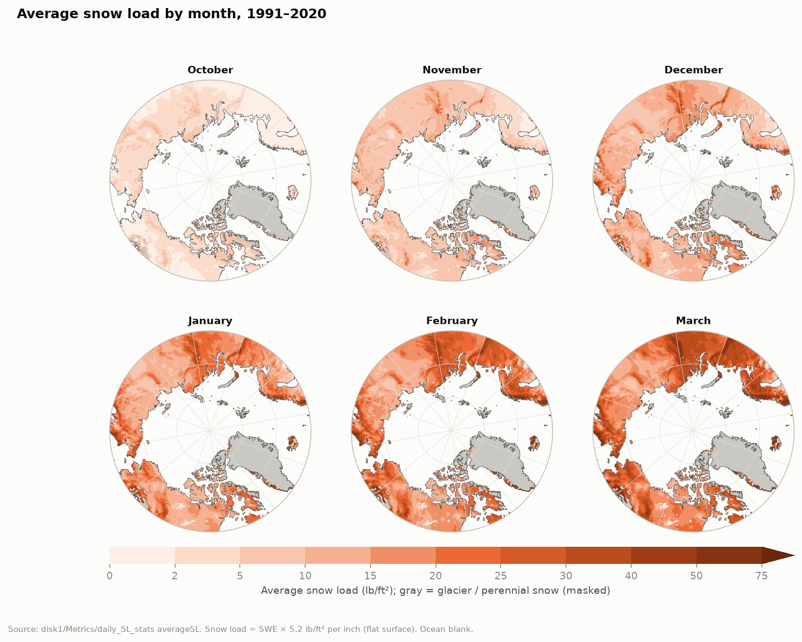

### Q8. Which structure design loads hold up?

This is the report's question, "what regions never experienced 25 lb/ft² snow load?". The answer depends on which load you design for:

| Share of non-glacier land below… | 10 | 20 | 25 | 48 lb/ft² |
|---|---:|---:|---:|---:|
| Typical seasonal peak (highest 30-yr-average day) | 4.9% | 40.4% | **57.4%** | 95.3% |
| 30-year record (`max_SL`) | 1.8% | 6.3% | **13.7%** | 64.5% |

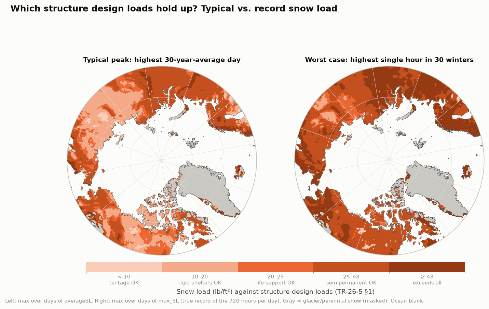

### Q9. When in the season does snow load arrive?

This reproduces SR-25-2 §3.6: the first day on which the 30-year average load crosses a threshold. The 10 lb/ft² (tentage) level arrives in October–November across much of Siberia and Scandinavia, and in December–January over most of Canada and Alaska. The 25 lb/ft² level is never reached on average over most of North America and eastern Siberia.

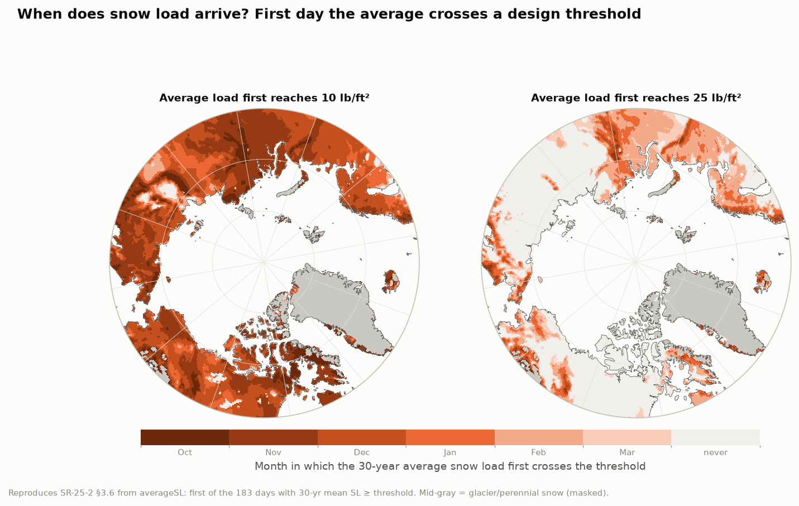

### Q10. Snow load through the season at specific sites

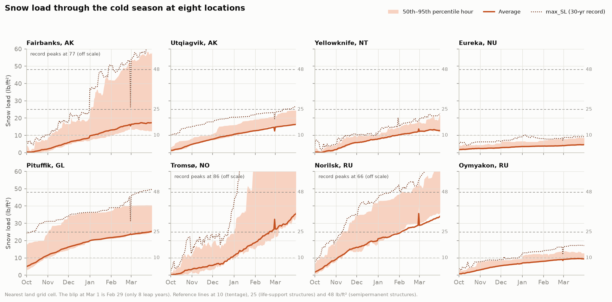

| Location | Peak avg SL (lb/ft²) | Record SL (lb/ft²) | Avg SL ≥ 25 from |
|---|---:|---:|---|
| Fairbanks, AK | 17.3 | 77.3 | never |
| Utqiagvik, AK | 16.3 | 26.5 | never |
| Yellowknife, NT | 13.3 | 22.7 | never |
| Eureka, NU | 4.6 | 10.2 | never |
| Pituffik, GL | 25.3 | 49.6 | Mar 28 |
| Tromsø, NO | 35.7 | 86.3 | Feb 22 |
| Norilsk, RU | 34.1 | 66.0 | Feb 4 |
| Oymyakon, RU | 9.6 | 17.3 | never |

Fairbanks shows a large gap between typical and record loads: from late February, its 95th-percentile hour is close to the record, so one or two very snowy winters dominate the tail. Worth confirming against station SWE before using that cell's extremes.

## 5. What the metrics cannot answer

- **Trends or year-to-year variability.** Every file pools all 30 winters, so nothing can be said about change over time, or what a "bad year" looks like, without returning to the hourly data in `disk1/data`.
- **Return periods.** With no annual maxima or minima per year (only their mean, in `min_WCT`), you can't fit an extreme-value distribution. `percentile_1` and `percentile_99` are the best available tails.
- **True WCT records, from `Metrics` alone.** See §2. They are available over land from the Atlas Extreme GeoTIFFs, and the `max_SL` record is in `Metrics`.
- **Joint conditions** (for example, wind chill at or below −40 °F *and* wind above 25 kt in the same hour). Each variable's statistics were computed separately.
- **Percentiles over periods longer than a day.** Daily percentiles can't be averaged into a correct monthly percentile (SR-25-2 §3.7 says the same).
- **Multi-day spell length** (consecutive runs reset each day), and **snow load on glaciers or sloped roofs.**

The 6-hour files add one more option not explored here: time-of-day structure (for example, whether −40 °F wind chill clusters at night). It is likely weak in midwinter at these latitudes, when there is little or no daylight.

## 6. Reproducing this

All code is in `eda/scripts/`. The source data is opened read-only.

```bash
micromamba create -f eda/environment.yml -p ~/micromamba/envs/azcot-eda   # once
PY=~/micromamba/envs/azcot-eda/bin/python
cd eda/scripts
$PY extract_report_text.py   # docs/*.pdf -> eda/reference/*.txt
$PY build_cubes.py 6         # 183 daily files -> eda/cache/{wct,sl}_daily.nc + masks.nc (~1 min, 6 workers)
$PY figures.py               # -> eda/figures/*.png   (or name specific figures, e.g. `figures.py sl_design`)
$PY stats.py                 # -> eda/tables/*.csv
$PY check_atlas_min.py       # Atlas 'Minimum' WCT rasters vs Metrics min_WCT
```

`eda/cache/` (about 0.8 GB) is git-ignored and can be rebuilt with `build_cubes.py`. Shared paths, the day calendar, and the location list are in `scripts/azcot.py`.
