# AZCOT plots from the preprocessed coverages

This document redraws the EDA's operational maps and charts ([eda/EDA.md](../eda/EDA.md) §4) from the curated NetCDF coverages built by [preprocess/](../preprocess/README.md). It also adds two things:

- **How to draw glaciers on snow-load maps** using the `surface_type` flag (§2).
- **Frostbite danger-level maps** in the green / amber / red classes of ERDC/CRREL TR-26-5 Tables 4–5 (§3).
- **Snowfall design-load maps** for tentage and rigid shelters (§3b).

**Caveat on wind chill (found 9 Oct 2026).** All wind chill figures in §1 use AZCOT's wind chill as distributed. It is computed from **skin** temperature, not the 2 m air temperature TR-26-5 specifies. Over land it runs about 3.5 °F colder, and it roughly doubles the share of hours at or below −65 °F (Jan 15: 10.1% vs. 5.3%; see [AZCOT_DATA_ISSUES.md](../AZCOT_DATA_ISSUES.md), issue 10). The frostbite maps in §3 use air temperature.

All figures come from the coverages in `/beegfs/CMIP6/jdpaul3/azcot_preprocess/coverages/`. Nothing reads the raw AZCOT data. To regenerate them, see §4.

**What changed from the EDA versions:**
- **Wind chill lows are true record lows.** `wct_min` replaces the EDA's `min_WCT`, which was an average of yearly lows. On the point charts the dotted line now sits *below* the percentile band, where a record low belongs.
- **Feb 29 is gone**, along with the Mar 1 spikes it caused.
- **Glaciers and perennial snow are drawn from `surface_type`** (gray tones), not from the EDA's ad-hoc mask.
- **Point charts use the nearest seasonal-land cell** (`surface_type == 1`). The eight locations land on the same grid cells as in the EDA, and the values agree (`tables/locations.csv`).

---

## 1. EDA §4 questions, redrawn

### Q1. How cold does it typically feel, where, and in which month?

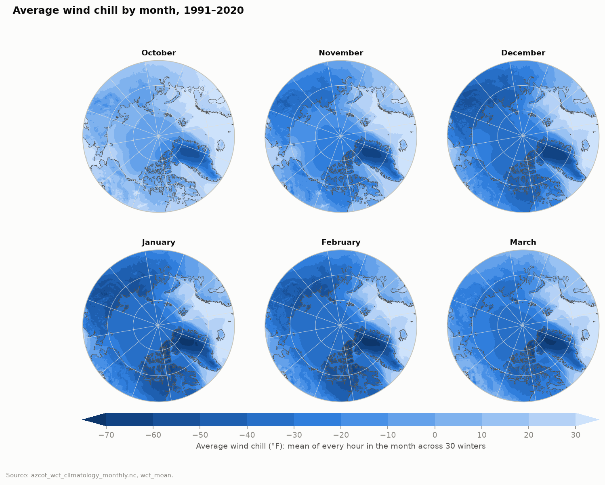

From `azcot_wct_climatology_monthly.nc` `wct_mean`. Greenland is coldest in every month. By December–February the Canadian Arctic Archipelago and interior northeastern Siberia approach it, while the North Atlantic side stays mild.

### Q2. How often is wind chill dangerous (≤ −40 °F)?

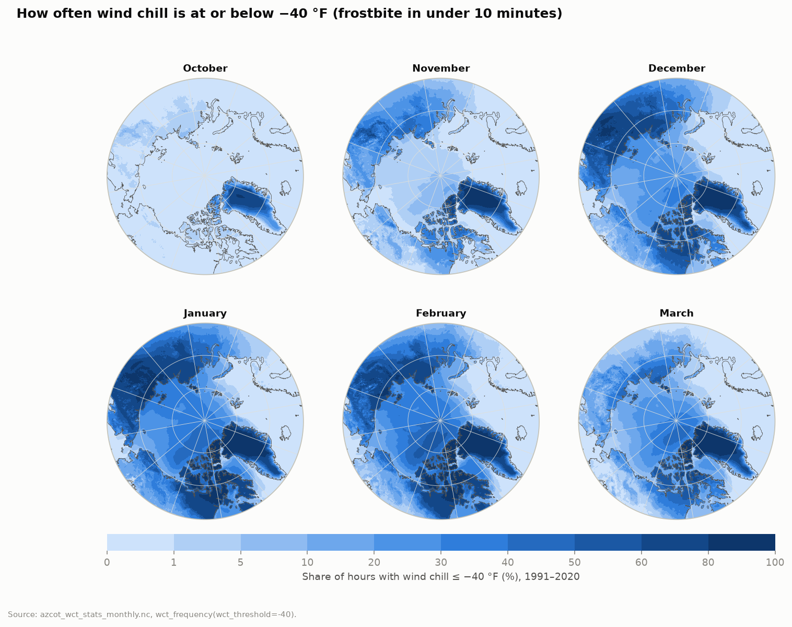

From `azcot_wct_stats_monthly.nc`, `wct_frequency.sel(wct_threshold=-40)`. Any threshold from 0 to −100 °F in 5 °F steps works the same way.

### Q3. Where does the Army's −65 °F requirement actually matter?

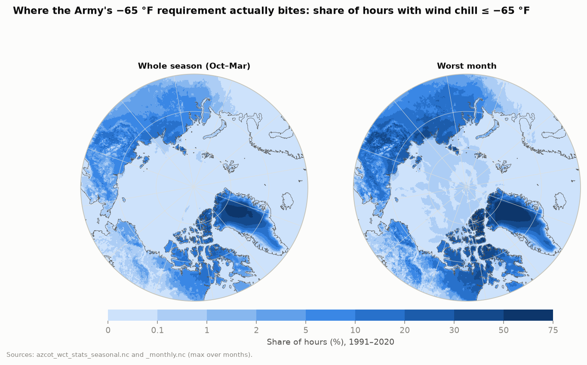

Seasonal and worst-month shares of hours at or below −65 °F. These are concentrated on the Greenland ice sheet, the Canadian Archipelago, and northeastern Siberia.

### Q4. Which cold zone should a unit equip for?

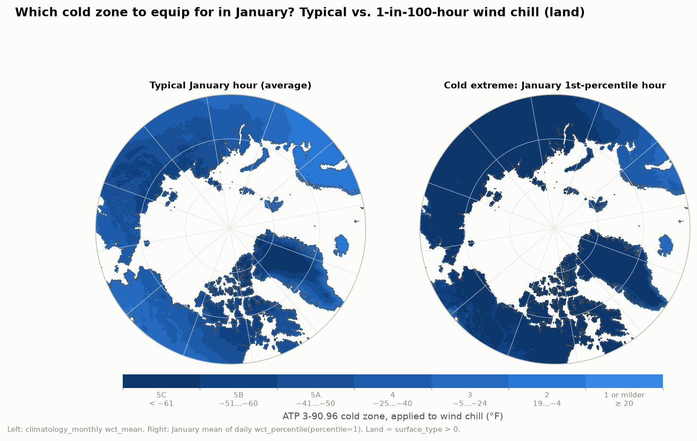

ATP 3-90.96 cold zones applied to the typical January hour (`wct_mean`) and to the January 1st-percentile hour (the daily `wct_percentile` averaged over January). Shown on land only (`surface_type > 0`).

### Q5. How does a specific site behave through the season?

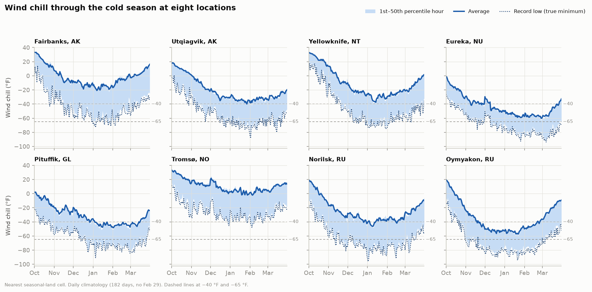

The band runs from the 1st to the 50th percentile hour. The dotted line is now the **true record low** for each calendar day; Fairbanks, for example, reaches −72.9 °F. In the EDA this line was `min_WCT`, which sat inside or even above the band.

### Q6. How long do dangerous spells last?

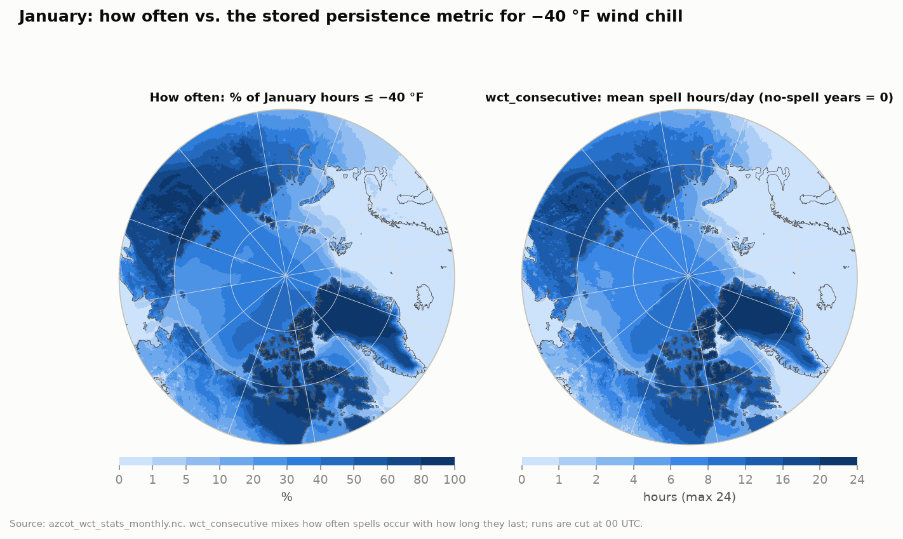

The same caveat as in the EDA applies. `wct_consecutive` counts years with no spell as 0, so it mixes how often spells happen with how long they last, and it tracks the frequency map closely.

### Q7. How heavy is the snow load, and how does it build?

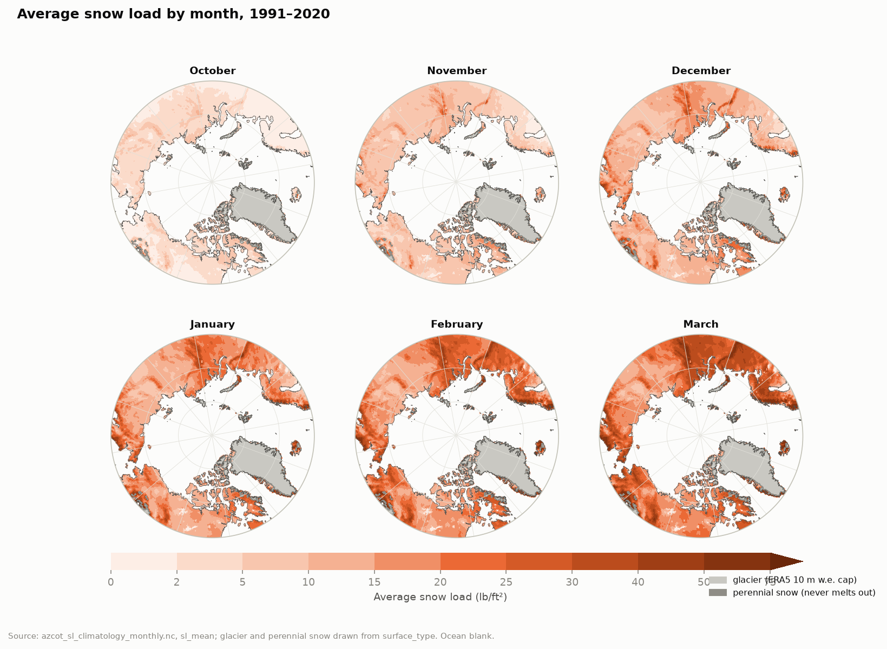

From `azcot_sl_climatology_monthly.nc` `sl_mean`. Glacier and perennial-snow cells are drawn in gray from `surface_type` (see §2).

### Q8. Which structure design loads hold up?

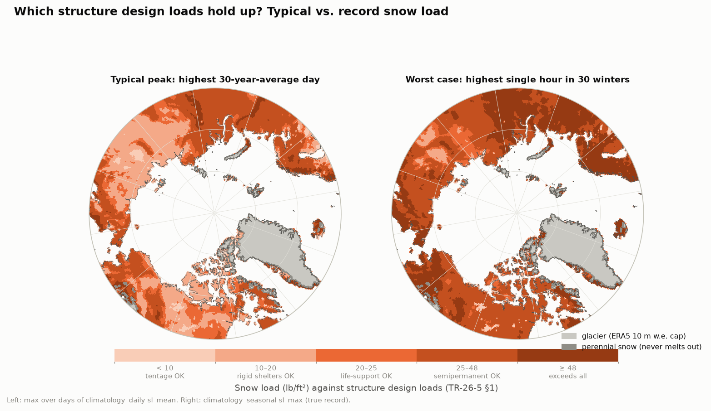

Left: the typical seasonal peak (highest 30-year-average day, from the daily `sl_mean`). Right: the 30-year record (`sl_max`, seasonal). The design loads are from TR-26-5 §1.

### Q9. When in the season does snow load arrive?

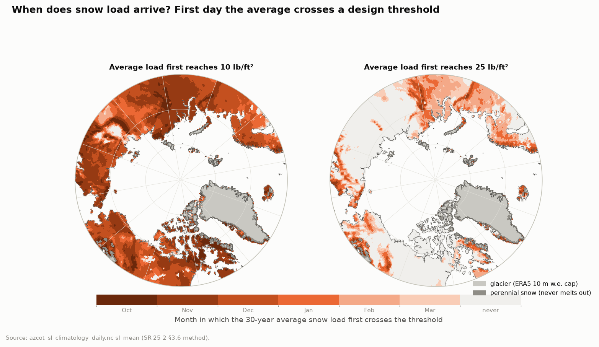

The first day on which the daily `sl_mean` crosses each threshold (the SR-25-2 §3.6 method).

### Q10. Snow load through the season at specific sites

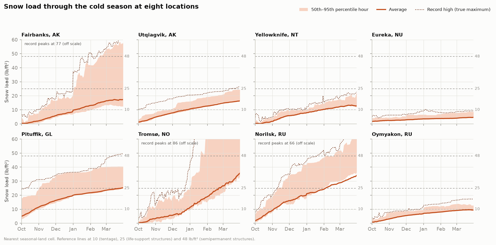

### Location summary (`tables/locations.csv`)

| Location | Jan avg WCT (°F) | Jan 1st-pct WCT (°F) | Record low WCT (°F) | % hrs ≤ −40 | % hrs ≤ −65 | % hrs green | % hrs amber | % hrs red | Peak avg SL | Record SL | Avg SL ≥ 25 from |
|---|---:|---:|---:|---:|---:|---:|---:|---:|---:|---:|---|
| Fairbanks, AK | −15.8 | −60.0 | −72.9 | 4.6 | 0.09 | 15.0 | 43.3 | 0.96 | 17.3 | 77.3 | never |
| Utqiagvik, AK | −33.9 | −65.8 | −88.2 | 19.8 | 0.82 | 8.2 | 70.4 | 0.47 | 16.3 | 26.5 | never |
| Yellowknife, NT | −30.3 | −66.2 | −74.9 | 12.7 | 0.39 | 11.1 | 57.5 | 1.05 | 13.3 | 22.7 | never |
| Eureka, NU | −55.0 | −78.0 | −93.7 | 60.2 | 10.59 | 2.5 | 85.0 | 11.03 | 4.6 | 10.2 | never |
| Pituffik, GL | −43.2 | −71.7 | −90.7 | 36.4 | 3.24 | 8.3 | 80.8 | 1.19 | 25.3 | 49.6 | Mar 28 |
| Tromsø, NO | 2.5 | −30.7 | −47.8 | 0.1 | 0.00 | 9.2 | 9.4 | 0.00 | 35.7 | 86.3 | Feb 22 |
| Norilsk, RU | −39.5 | −78.0 | −96.1 | 27.9 | 3.89 | 8.9 | 71.5 | 2.98 | 34.1 | 66.0 | Feb 4 |
| Oymyakon, RU | −52.9 | −80.3 | −94.2 | 46.9 | 8.25 | 4.7 | 57.2 | 30.95 | 9.6 | 17.3 | never |

The percentages are shares of all Oct–Mar hours. Green, amber and red are the exact frostbite danger levels from §3 (updated 9 Oct 2026); the wind chill columns use AZCOT's skin-temperature wind chill.

---

## 2. Drawing glaciers and perennial snow on snow-load maps

The snow-load coverages are **NaN** wherever `surface_type ≠ 1`, which covers ocean, glacier, and perennial snow. The reason is that ERA5 does not model snow on glaciers. It holds them at a constant 10 m of water equivalent, which equals 2047 lb/ft² (Muñoz-Sabater et al. 2021; see the [preprocess README](../preprocess/README.md#glaciers-and-surface_type)). The figure below shows the same quantity, the highest hourly snow load in 30 winters, drawn four ways.

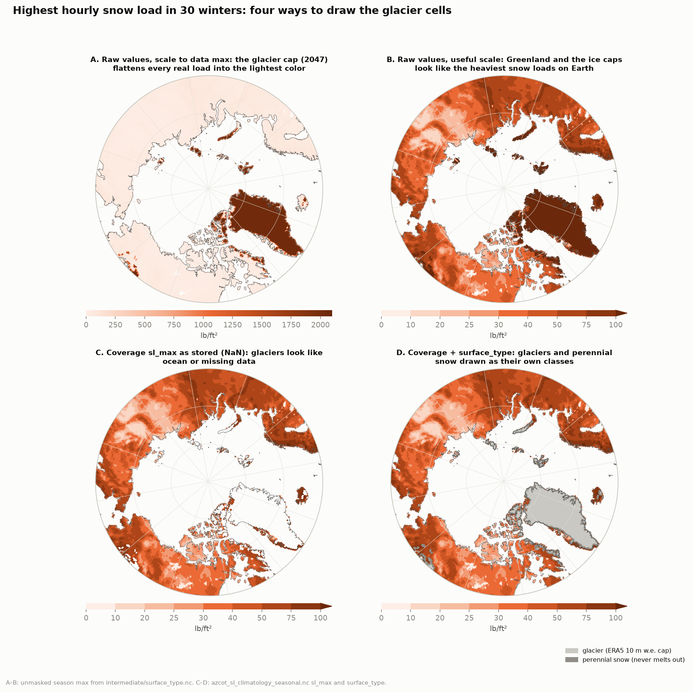

- **A. Raw values, scale to the data maximum.** The 2047 cap sets the top of the color scale, so every real snow load on Earth (0–90 lb/ft²) lands in the lightest color. The map says nothing.
- **B. Raw values, useful scale.** The real loads become visible, but Greenland, Svalbard, and the ice caps now look like the heaviest snow loads anywhere. A planner would wrongly conclude those are the worst places for structures.
- **C. The coverage as stored (NaN).** The misleading values are gone, but glaciers now look exactly like ocean or missing data. A reader can't tell "no snow-load estimate here because it's an ice sheet" from "no data" or "sea".
- **D. Coverage plus `surface_type`.** Real loads use the normal color scale, and glaciers (light gray) and perennial snow (dark gray) get their own legend entries. This is the recommended map product.

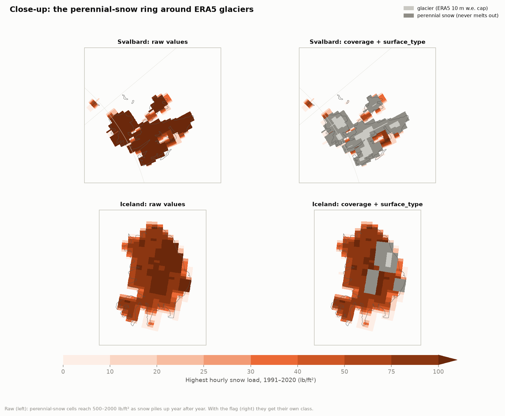

The close-up shows why there are *two* classes. ERA5 applies the 10 m constant only to grid boxes that are more than 50% ice. The partly glaciated boxes around them use the normal snow model, but their snow never melts out in summer, so it piles up year after year to 500–2000 lb/ft². On Svalbard and Iceland these perennial-snow cells (dark gray) outnumber the capped glacier cells (light gray). Masking only the capped cells would leave a ring of absurd snow loads around every ice cap.

**When to symbolize `surface_type`:**

- **Any map a person will read**, such as planning maps, Atlas-style products, or briefings. It turns "missing" into an explanation and stops readers inferring "no snow", "no data" or "worst snow load".
- **When glaciers are part of the area of interest**, e.g. Greenland, Svalbard, the Canadian Archipelago, coastal Alaska ranges, or Iceland. Operations there still need to know the surface is ice, even though there's no meaningful snow-load number.
- **In legends and statistics tables**, to report how much of a region is glacier or perennial snow instead of silently dropping it.

**When it isn't needed:**

- **Numeric analysis of seasonal snow load**, such as area averages, thresholds, or the design-load percentages in Q8. The NaN mask already excludes the right cells. Use `surface_type` only to report what was excluded.
- **Wind chill maps.** WCT isn't masked: wind chill over ice and sea ice is physically meaningful. Use `surface_type > 0` only if you want land-only WCT maps (as in Q4).

**How to do it** (for any tool that layers rasters): draw the snow-load variable first, then add `surface_type` as a second layer showing only classes 2 and 3 in their own colors. In Python this is `draw_surface_types()` in `plots/scripts/style.py`. In ArcGIS or QGIS, add `surface_type` with a unique-values renderer and make classes 0 and 1 transparent.

---

## 3. Frostbite danger levels

TR-26-5 (Tables 4 and 5, from Nelson et al. 2002) defines three frostbite danger levels by **time until frostbite on dry, exposed skin**:

| Level | TR-26-5 color | Time to frostbite | Used here |
|---|---|---|---|
| Slight danger | green | < 120 min | 45 < FT ≤ 120 min |
| Increased danger | orange (shown here as **amber**) | < 45 min | 5 < FT ≤ 45 min |
| Great danger | red | ≤ 5 min | FT ≤ 5 min |

**These maps are exact for the report's method.** Every hour of 1991–2020 (Oct–Mar) gets its time to frostbite from TR-26-5 **Eq. 5**, using that hour's 2 m air temperature and 10 m wind speed ([preprocess](../preprocess/README.md), steps 9 and 11). The hours are then counted per level.

*Until 9 October 2026 these maps approximated the levels with wind-chill cut-offs (0 / −20 / −60 °F), because the coverages held only wind chill. That approximation also inherited AZCOT's wind chill, which turns out to use skin temperature instead of air temperature ([AZCOT_DATA_ISSUES.md](../AZCOT_DATA_ISSUES.md), issue 10).*

### Table 4 vs. Eq. 5

Table 4 colors its wind chill values by frostbite time, and those colors don't follow from wind chill alone. The figure compares the published colors (left) with Eq. 5 at the same air temperature and wind (right):

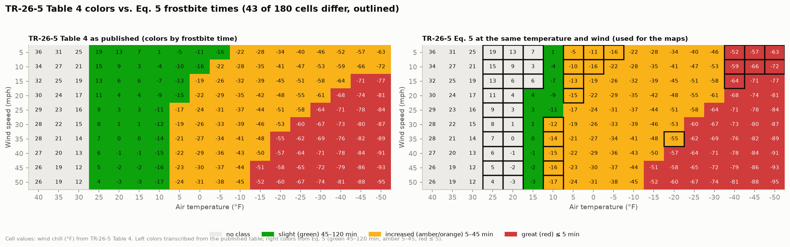

43 of the 180 cells differ, for three reasons:
- **Green above 23 °F.** The table shades cells green at air temperatures of 10–25 °F, down to wind chills of +19 °F. There, Eq. 5 gives no frostbite (it is undefined at or above 23.4 °F) or more than 120 minutes. This contradicts the table's own "< 120 min" label, and Table 5 also shades ">120" cells green.
- **Low wind, very cold air.** At −40 to −50 °F with 5–15 mph wind, Eq. 5 gives 5 minutes or less (red), while the table shows orange. Eq. 5 is faster than Table 5 at low wind; at −10 °F and 5 mph it gives 14 minutes against the table's 31.
- **The amber/green edge.** Eq. 5 starts amber at slightly warmer air than the table does: at −5 to +5 °F with 5–10 mph wind, and at 10 °F with 30–50 mph.

Table 4's 15 °F column also duplicates its 10 °F column. We use Eq. 5 because it is the report's stated method and applies to any temperature and wind.

### What share of hours falls in each danger level?

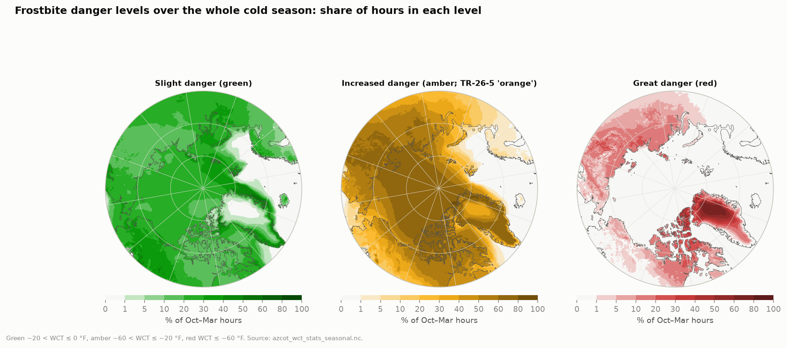

Averaged over all land cells, including the ice sheets (unweighted pixel means), Oct–Mar hours divide as follows. The earlier wind-chill approximation is shown for comparison:

| Level | Exact (Eq. 5) | Earlier approximation |
|---|---:|---:|
| No frostbite danger | 23% | 25% |
| Green | 8% | 20% |
| Amber | 62% | 45% |
| Red | 6.7% | 10.8% |

In January the red share is 13%. Red occurs at some point on **91% of land**, and in at least 10% of hours in its worst month on **45%**.

At the example sites (share of Oct–Mar hours, green / amber / red, in %):

| Site | Exact | Earlier approximation |
|---|---|---|
| Fairbanks | 15 / 43 / 1.0 | 31 / 20 / 0.4 |
| Utqiagvik | 8 / 70 / 0.5 | 24 / 52 / 2.1 |
| Eureka | 3 / 85 / 11 | 11 / 68 / 19 |
| Oymyakon | 5 / 57 / 31 | 15 / 60 / 14 |
| Tromsø | 9 / 9 / 0.0 | 19 / 4 / 0.0 |

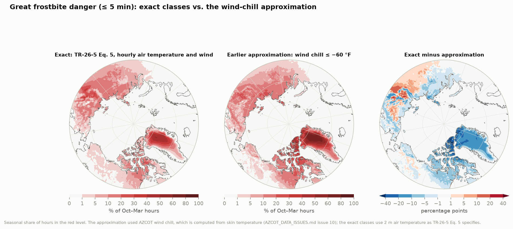

The red level moves in two directions:
- It shrinks over Greenland, the Canadian Archipelago and coastal Arctic, where the skin-temperature wind chill ran too cold.
- It grows in the calm, very cold interior of East Siberia (Oymyakon 31% vs 14%). There Eq. 5 gives fast frostbite even without wind, which wind chill doesn't capture.

**By month, one map series per level:**

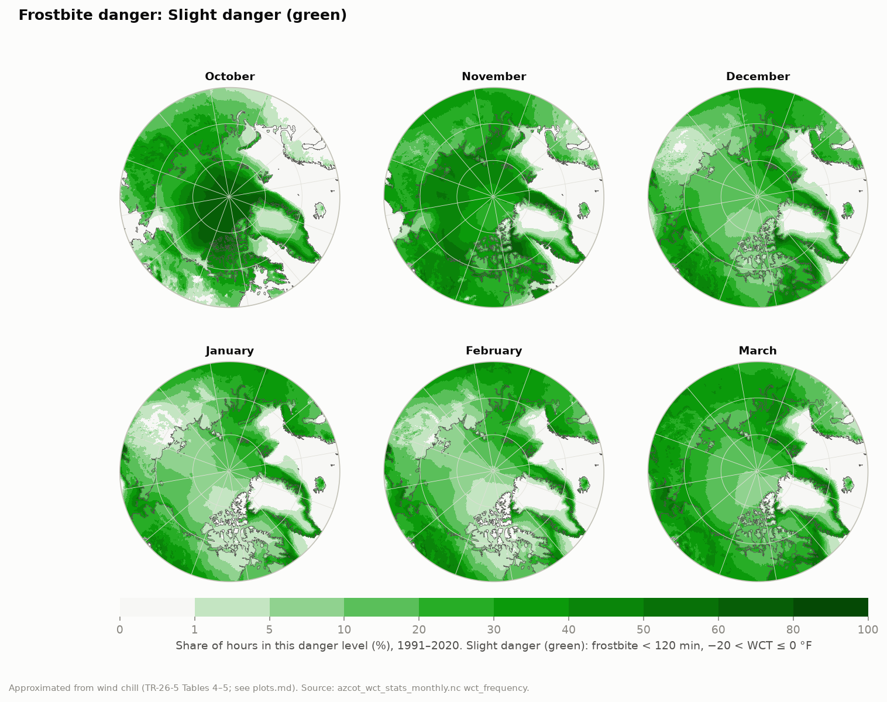

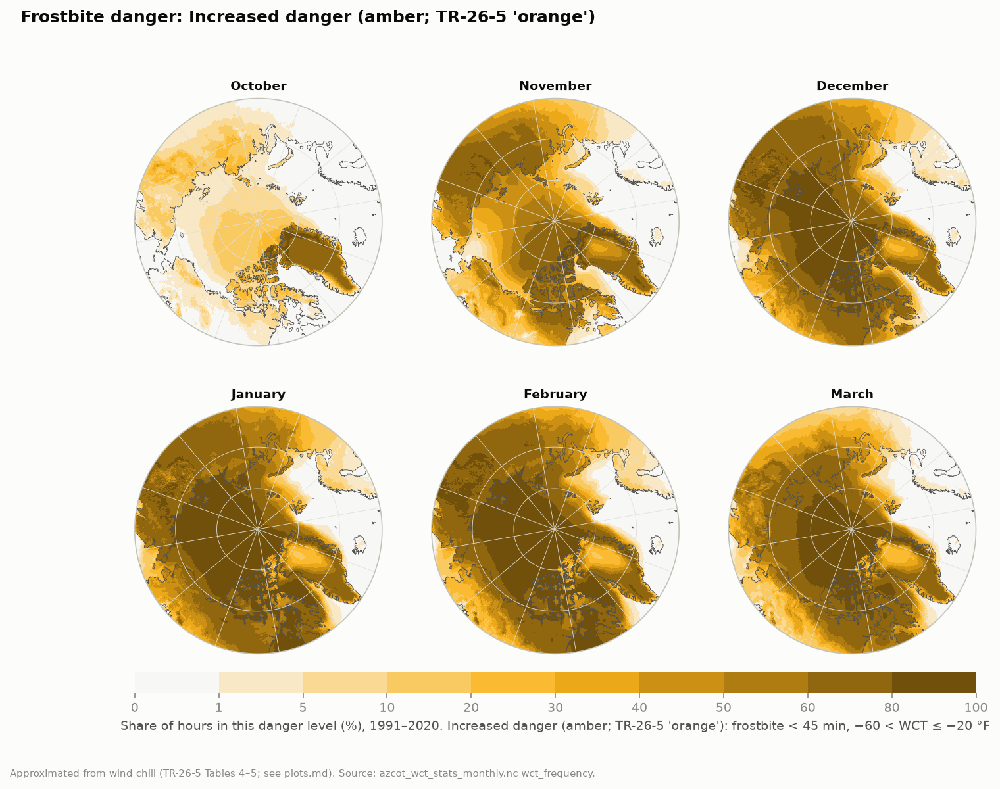

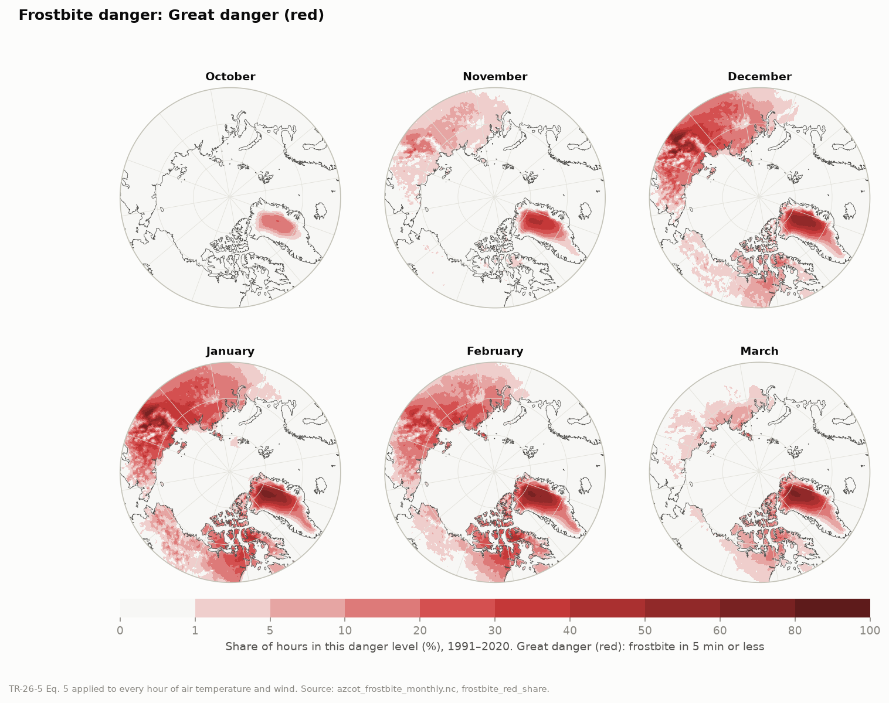

### Which level dominates each month?

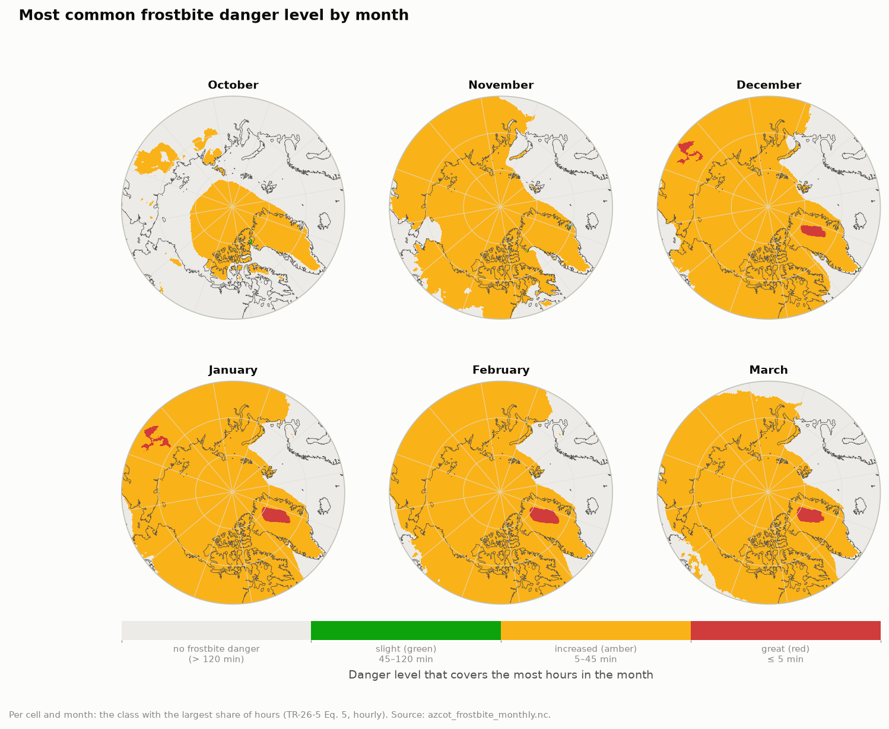

For a single map per month, this shows the class (including "no danger") that covers the most hours in each grid cell. Amber dominates almost all of the Arctic from November to March. Red dominates the Greenland interior from December to March, and the coldest Siberian valleys in December and January. Because each cell shows only one class, this map hides how often the other classes occur, so use the per-level maps above for planning.

## 3b. Snowfall design loads: tentage and rigid shelters

TR-26-5 §1 gives two design loads that depend on **snowfall**, not on the snow on the ground:
- **Tentage** must carry 10 lb/ft² from one 24-hour snowfall.
- **Rigid shelters and portable hangars** must carry 20 lb/ft² from one storm lasting more than a day, being cleared between storms.

AZCOT's snow load (SL) is the snowpack, so it can't answer either. These maps use ERA5 hourly snowfall from SNAP's existing ERA5 holdings, read in place ([preprocess](../preprocess/README.md), steps 10–11).
- **24-hour load:** the largest trailing 24-hour snowfall, as water equivalent × 204.7 lb/ft² per m.
- **Storm:** wet hours (≥ 0.1 mm water equivalent) with dry gaps of at most 12 h. A half-day lull is taken as the chance to clear the shelter. The definition is ours, because the report gives none. It matters only in snowy maritime climates, where it can change the answer: Tromsø's record storm is 14.9, 30.9 or 36.8 lb/ft² with a 6, 12 or 24 h gap. See [preprocess/storm_definition/README.md](../preprocess/storm_definition/README.md).

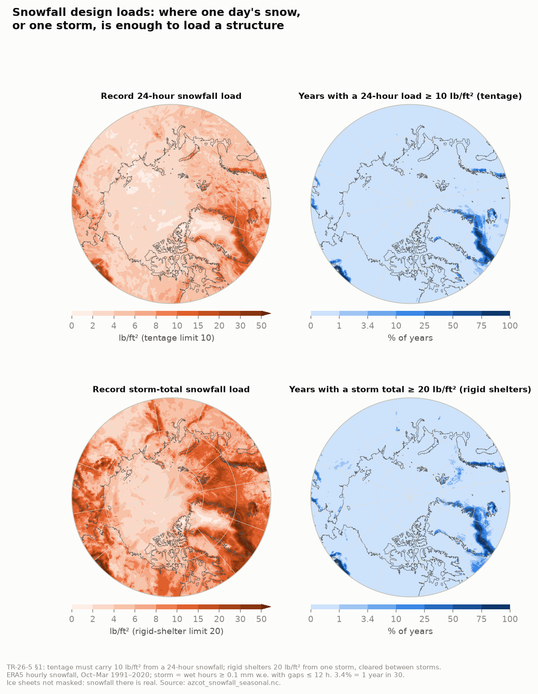

**Across most of the Arctic, neither load is ever reached.** On non-glacier land the average record 24-hour load is 4.6 lb/ft², and only **2.8%** of land saw 10 lb/ft² in one day in 30 winters. The average record storm total is 8.3 lb/ft², and only **4.4%** of land saw a 20 lb/ft² storm. Those places are maritime and mountainous: southeast Greenland, Iceland, coastal Norway, southern coastal Alaska, and Russia's Pacific coast. Record 24-hour loads at the example sites, in lb/ft²: Eureka 2.4, Oymyakon 2.7, Utqiagvik 3.4, Yellowknife 4.4, Fairbanks 4.6, Norilsk 5.7, Pituffik 6.6, Tromsø 7.3. Valdez, Alaska, a snowy maritime comparison, reaches 21.7.

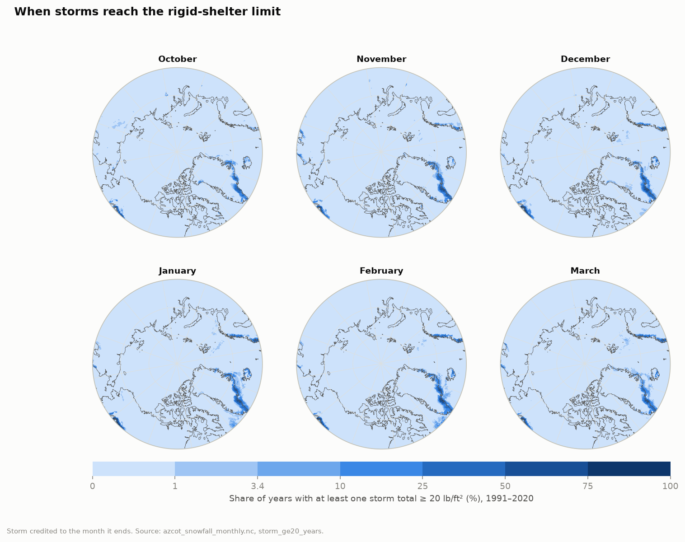

Where storms do reach the shelter limit, they do so in every month from October to March, most often along the southeast Greenland and southern Alaska coasts.

The coverages also hold a **72-hour** load, which needs no storm definition, so the storm numbers can be checked against it. The monthly histograms (`azcot_snowfall_histogram_monthly.nc`) give the share of days or storms beyond any other limit.

---

## 4. Reproducing

```bash
PY=~/micromamba/envs/azcot-eda/bin/python     # spec: eda/environment.yml
cd plots/scripts
$PY make_plots.py              # all figures + tables/locations.csv (a few minutes on a login node)
$PY make_plots.py q8 fb_red    # or just some: q1..q10, surface, surface_zoom, fb_monthly, fb_seasonal,
                               #   fb_dominant, fb_table4, fb_exact_vs_wct, snowfall_design,
                               #   snowfall_storm_monthly, tables
```

Set `AZCOT_PRE_OUT` to read coverages from a different preprocess output root. The code is in `scripts/style.py` (palette, polar maps, `surface_type` symbology) and `scripts/make_plots.py` (one function per figure; `fb_shares()` reads the exact frostbite coverages, and `FB_CUTS` / `fb_shares_wct()` keep the old wind-chill approximation for the comparison figure).
